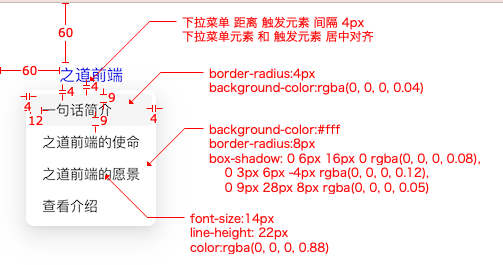

# `[P8-s1]` Dropdown下拉菜单组件-基础版

## 项目阶段简介

### 项目阶段介绍

按照设计稿和组件说明，实现基础版的 Dropdown下拉菜单组件。

基础版的 Dropdown下拉菜单组件只需要能正确初始化组件，并能够正确弹出下拉菜单就可以了。

### 组件说明

- 可以在 hover 触发元素的时候展示下拉菜单
- 可以通过配置项创建菜单
- 菜单出现的位置固定在触发元素的下方，并和触发元素居中对齐

### 设计稿说明

- 设计稿中随便写一个 a 标签，文案是【之道前端】，触发元素的样式并不重要，因此不需要特别定制，为了让下拉菜单更好的显示，要给页面添加 `padding: 60px` 的间距
- 当鼠标 hover 到 a 标签上时，展示出下拉菜单。
  - 下拉菜单出现的位置固定在 a 标签的下方，间隔 `4px`，并和 a 标签居中对齐
  - 下拉菜单有 4 个选项，每个选项都可以被点击，执行一些简单的动作，菜单的文案和具体的动作你可以自定义

- 当鼠标移出 a 标签时，下拉菜单要隐藏
- 当鼠标移出下拉菜单时，下拉菜单要隐藏

> [在线体验](https://zhidaofe.github.io/P8-dropdown-component/s1/index.html)

### 项目要求

- 先按照设计稿和组件说明，实现组件代码。然后在页面中使用你实现的组件来达到题目要求
- 保证最终实现的页面完全复现设计稿，真实的工作中，火眼金睛的设计师 1 px 的差异都能找到，不要心存侥幸
- **先按照设计稿和组件说明真得去开发，不要看参考答案！**，也不要去看业界和开源的组件库代码
- 触发元素的事件处理和下拉菜单的展示/隐藏处理，它俩之间的配合，是这个项目的难点，希望你要通过自己的思考和练习去感受这里的逻辑，不要直接查看答案
- 如果开发过程中碰到问题，不知道怎么实现的话，去网上查找答案，不要去看答案！在真实的工作中，你不会有参考答案的，你只能自己想办法找到问题的解决方案
- 记录你的疑问，比如：
  - 有个很难实现的地方，总感觉自己实现的方案不是最优方案，还有更好的方案
  - 不知道自己的实现方案到底好不好
  - 完成开发之后，再整体 review 一遍自己的代码，觉得还有哪些地方是不够好的

- 带着你的疑问，再去查看参考答案或者开源组件库去寻找答案，如果还是没有得到解答，请来 [**之道前端**](https://kcnrozgf41zs.feishu.cn/wiki/PBj0w5rjUiEWVgktZE0caKOunNc) 提问

### 练习本项目你会收获什么？

- 提升原生 JavaScript 的编码熟练度
- 学会正确使用原生 JavaScript 创建 Dom、操作 Dom、计算 Dom 的位置
- 学会正确使用原生 JavaScript 处理 DOM 事件
- 学会如何封装一个组件
- 【进阶】深刻理解什么是好的组件
- 【进阶】积累封装组件的经验
- 【进阶】逐渐形成自己的 JavaScript 代码风格

> 如果只实践一次，那就只会有基础收获
>
> 只有不断练习、思考、优化，才会有进阶收获

### 本项目适合的同学

- 处于 L2 水平的同学
- 对原生 JavaScript 还不熟练的同学
- 没怎么封装过 UI 组件的同学
- 没怎么写过 C 端页面，大部分时间在做 admin 系统的同学
- 只会开发 React/Vue 组件，想要练习如何封装原生 JavaScript 组件的同学

## 开始练习

我们针对不同经验的同学提供了相应的[练习指引手册](https://kcnrozgf41zs.feishu.cn/wiki/An7GwvUQrirdvdkJdQ9c4q3Rndd)，你可以按照这个指引手册来练习本项目。

