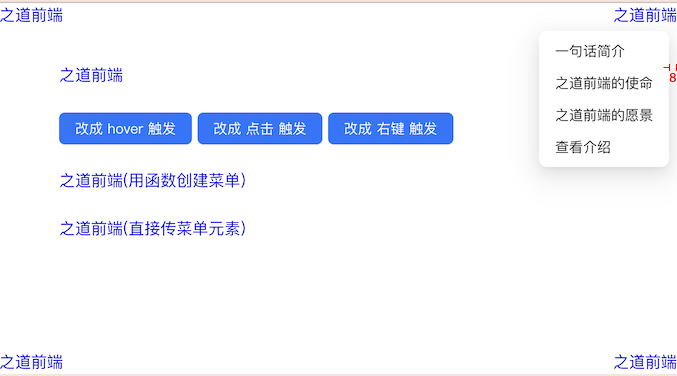

# `[P8-s2]` Dropdown下拉菜单组件-增强版

## 项目阶段简介

### 项目阶段介绍

按照设计稿和组件说明，扩展基础版 Dropdown 下拉菜单组件，实现增强版的 Dropdown 下拉菜单组件。

增强版的 Dropdown 下拉菜单组件支持多种下拉菜单触发方式，并且可以动态切换。

同时，增强版的 Dropdown 下拉菜单组件还能正确处理下拉菜单在页面边界展示不全的问题。

### 组件说明

- 可以自定义触发方式：hover，click，右键
- 支持多种创建菜单的方式
  - 可以通过配置项创建菜单（实际上是menu组件的雏形）
  - 可以通过自定义函数或者直传 下拉菜单的根元素来创建菜单
- 能够通过参数控制菜单必定会完整展示在视窗内（对于贴近视窗边缘的场景处理）

### 设计稿说明

- 跟之前一样，我们基于 s1 的代码来进行扩展，因此 s1 的按钮仍然在页面中，功能没变，下拉菜单默认是 hover 的触发方式。
- 然后下面有 3 个按钮，从左到右分别是：
  - 【改成 hover 触发】按钮：点击这个按钮之后，上面【之道前端】链接的下拉菜单触发方式被改成 hover 触发方式，如果它原来就是 hover 触发方式的话，这个按钮点击之后什么事情都不会发生。
  - 【改成 点击 触发】按钮：点击这个按钮之后，上面【之道前端】链接的下拉菜单触发方式被改成【点击】的触发方式，如果它原来就是点击触发方式的话，这个按钮点击之后什么事情都不会发生。
    - 当下拉菜单展示时，如果点击了下拉菜单的选项，在执行了菜单动作之后，需要收起下拉菜单；
    - 当下拉菜单展示时，在网页中任意点击，需要收起下拉菜单。
  - 【改成 右键 触发】按钮：点击这个按钮之后，上面【之道前端】链接的下拉菜单触发方式被改成鼠标右键的触发方式，如果它原来就是右键触发方式的话，这个按钮点击之后什么事情都不会发生。
    - 当下拉菜单展示时，如果点击了下拉菜单的选项，在执行了菜单动作之后，需要收起下拉菜单；
    - 当下拉菜单展示时，在网页中任意点击，需要收起下拉菜单。
- 接下来一行是【之道前端(用函数创建菜单)】链接，这个链接的下拉菜单组件需要使用函数生成下拉菜单的方式，具体的下拉菜单内容和样式你可以自定义。
- 再接下来一行是【之道前端(直接传菜单元素)】链接，这个链接的下拉菜单组件需要使用直接传 Dom 元素的形式生成下拉菜单的方式，具体的下拉菜单内容和样式你可以自定义。
- 最后，页面的 4 个角落都分别有一个【之道前端】的链接，他的下拉菜单内容你可以自定义，不过我建议你直接复制最开始的 s1 的下拉菜单内容就好了。这 4 个角落的下拉菜单可以被完全展示出来，它跟浏览器视窗的边界间距为 `8px`。

> [在线体验](https://zhidaofe.github.io/P8-dropdown-component/s2/index.html)

### 项目要求

- 增强版是要在基础版的 Dropdown 下拉菜单组件上进行扩展的，因此把你的 s1 答案 copy 过来之后，再进行 s2 的练习
- 先按照设计稿和组件说明，实现组件代码。然后在页面中使用你实现的组件来达到题目要求
- 保证最终实现的页面完全复现设计稿，真实的工作中，火眼金睛的设计师 1 px 的差异都能找到，不要心存侥幸
- **先按照设计稿和组件说明真得去开发，不要看参考答案！**，也不要去看业界和开源的组件库代码
- 如果开发过程中碰到问题，不知道怎么实现的话，去网上查找答案，不要去看答案！在真实的工作中，你不会有参考答案的，你只能自己想办法找到问题的解决方案
- 记录你的疑问，比如：
  - 有个很难实现的地方，总感觉自己实现的方案不是最优方案，还有更好的方案
  - 不知道自己的实现方案到底好不好
  - 完成开发之后，再整体 review 一遍自己的代码，觉得还有哪些地方是不够好的
- 带着你的疑问，再去查看参考答案或者开源组件库去寻找答案，如果还是没有得到解答，请来 [**之道前端**](https://kcnrozgf41zs.feishu.cn/wiki/PBj0w5rjUiEWVgktZE0caKOunNc) 提问

### 练习本项目你会收获什么？

- 提升原生 JavaScript 的编码熟练度
- 学会正确使用原生 JavaScript 创建 Dom、操作 Dom、计算 Dom 的位置
- 学会正确使用原生 JavaScript 处理 DOM 事件绑定和解绑
- 掌握多个不同的 DOM 事件
- 学会如何封装一个组件
- 【进阶】深刻理解什么是好的组件
- 【进阶】积累封装组件的经验
- 【进阶】逐渐形成自己的 JavaScript 代码风格

> 如果只实践一次，那就只会有基础收获
>
> 只有不断练习、思考、优化，才会有进阶收获

### 本项目适合的同学

- 处于 L2 水平的同学
- 对原生 JavaScript 还不熟练的同学
- 没怎么封装过 UI 组件的同学
- 没怎么写过 C 端页面，大部分时间在做 admin 系统的同学
- 只会开发 React/Vue 组件，想要练习如何封装原生 JavaScript 组件的同学

## 开始练习

我们针对不同经验的同学提供了相应的[练习指引手册](https://kcnrozgf41zs.feishu.cn/wiki/An7GwvUQrirdvdkJdQ9c4q3Rndd)，你可以按照这个指引手册来练习本项目。

